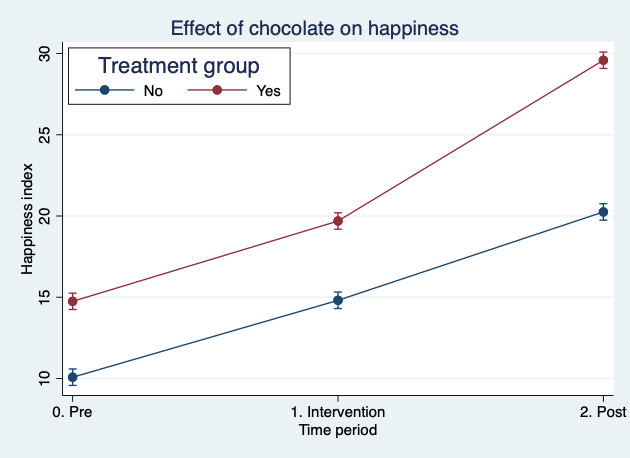

```{r load-packages, include=F}
library(kableExtra)
library(xtable)
```

## Abstract
- Why did we start? Because chocolate.
- What did we do? Ate chocolate.
- What did we find? It’s delicious.
- What does it all matter? It's obvious!


## Background

Let’s face it. Chocolate is delicious, and it seems impossible that it might not be good for you. However, the science is unclear, at least for some outcomes.[@Chan:2007th]

## Methods

We recruited students who thought they were coming for training in reproducible research methods as a pre-text for eating chocolate in the morning. We measured their happiness using our established, validated index. 

We calculated some descriptive statistics and ran a simple linear regression model:

$$
y_{it}=\beta_{0} + \beta_{1}*Treated + \beta_{2}*Period + \epsilon_{it}
$$

We also explored a model with a product term, but not because p>0.05 in the previous model. Honest.

## Results

Descriptive statistics are shown in Table 1

<center>
\input{choc-t1.tex}
</center>

Estimates from the regression analysis are shown in Table 2. Regression results clearly show that chocolate increases happiness.  We can see that the overall happiness index for the chocolate group was 4.67 units higher in the post period relative to the change over the same period in the control group [95% CI: 3.66, 5.68].

\input{choc-t2.tex}

Regression results clearly show that chocolate increases happiness, but if you aren’t convinced please see Figure 1.



## Discussion

We think this is convincing. But it may not matter for policy since another randomized trial showed that many participants switched groups mid-study because of their personal chocolate preferences.[@Scaramuzza:2015fy]

## References
